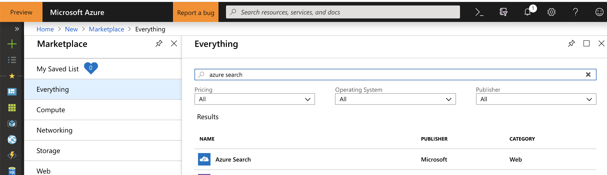
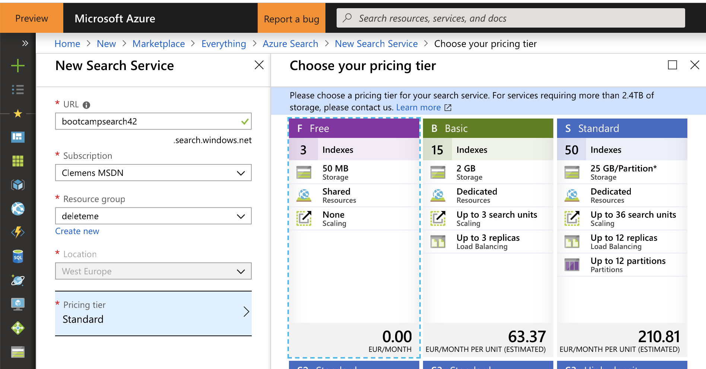
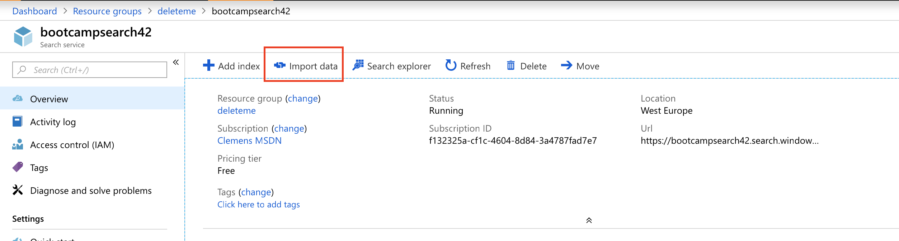
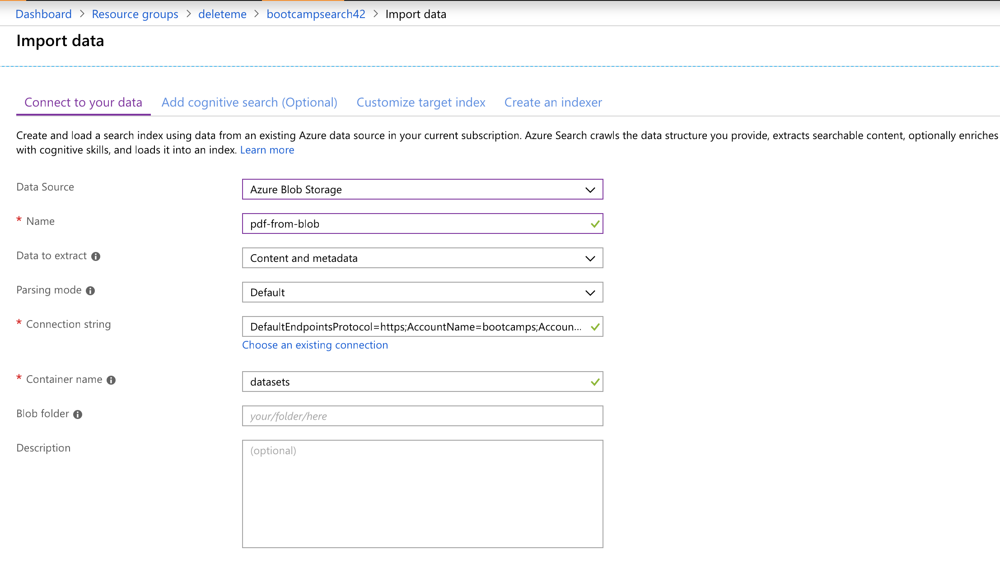
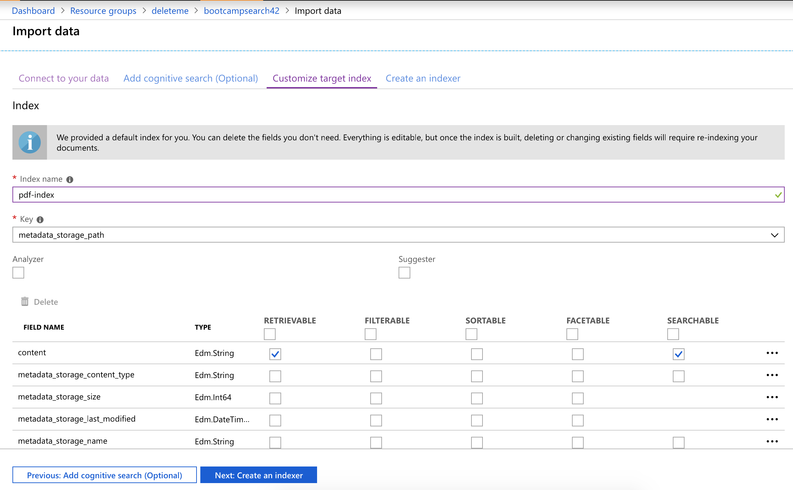
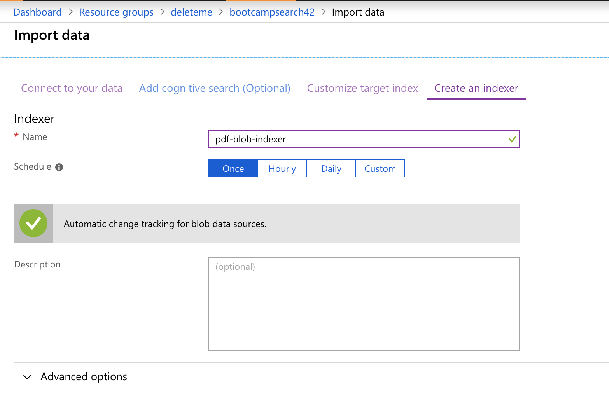
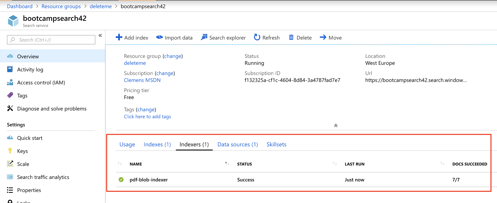

# Hints for Challenge 1

## Indexing PDF data

First, create a `Azure Search` instance in the Azure Portal:

For our purposes, the `Free Tier` is sufficient:

However, the `Free Tier` does not support additional replicas, scaling and is only able to index documents with up to 32000 characters/document. If we want to index longer documents, we need to go to a bigger tier (64000 for `Basic`, 4m for `Standard` and above - as of November 2018).

Once provisioned, our service will be reachable via `https://xxxxxxx.search.windows.net`

Next, we need to create an new `Storage Account` and create a new `Blob container`, where we'll upload our [dataset](../data/search-dataset-pdf.zip) to. We can do this completely through the Azure Portal, use [Storage Explorer](https://azure.microsoft.com/en-us/features/storage-explorer/) or use the API/CLI.

Once we have uploaded the PDF files, we can go into our Azure Search instance and goto `Import Data`:

Next, we need to define the `Data Source`:

We'll skip `Cognitive Search` for this example (we'll get back to it soon). Azure Search automatically looks at the Blob container and will now extract the content and the metadata from all the PDFs. Let's give our Index a better name:

Question: Does it makes sense to have any of the fields `Filterable`, `Sortable`, or `Facetable`?

Lastly, we need to give our Indexer a name and also set the schedule. In our case, we'll only run it once, but in a real world scenario, we might want to keep it running to index new, incoming data:

After a minute or two, our Indexer will have indexed all the PDFs and we should be able to query them.

## Querying Content

