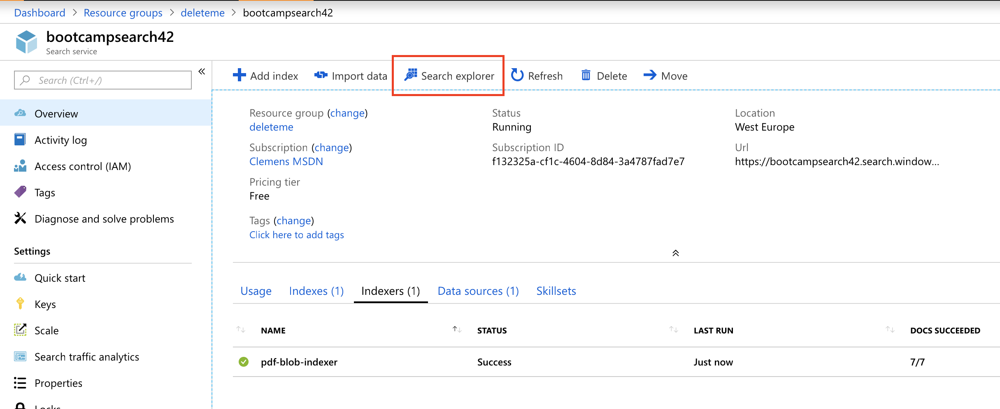
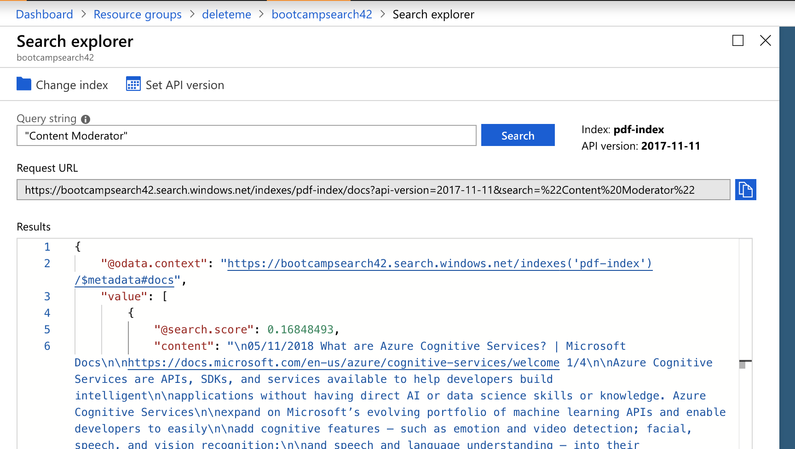

# Hints for Challenge 1

## Indexing PDF data

First, create a `Azure Search` instance in the Azure Portal:


For our purposes, the `Free Tier` is sufficient:


However, the `Free Tier` does not support additional replicas, scaling and is only able to index documents with up to 32000 characters/document. If we want to index longer documents, we need to go to a bigger tier (64000 for `Basic`, 4m for `Standard` and above - as of November 2018).

Once provisioned, our service will be reachable via `https://xxxxxxx.search.windows.net`

Next, we need to create an new `Storage Account` and create a new `Blob container`, where we'll upload our [dataset](../data/search-dataset-pdf.zip) to. We can do this completely through the Azure Portal, use [Storage Explorer](https://azure.microsoft.com/en-us/features/storage-explorer/) or use the API/CLI.

Once we have uploaded the PDF files, we can go into our Azure Search instance and goto `Import Data`:


Next, we need to define the `Data Source`:


We'll skip `Cognitive Search` for this example (we'll get back to it soon). Azure Search automatically looks at the Blob container and will now extract the content and the metadata from all the PDFs. Let's give our Index a better name:


:question: Question: Does it make sense to have any of the fields `Filterable`, `Sortable`, or `Facetable`?

Lastly, we need to give our Indexer a name and also set the schedule. In our case, we'll only run it once, but in a real world scenario, we might want to keep it running to index new, incoming data:


After a minute or two, our Indexer will have indexed all the PDFs and we should be able to query them.


## Querying Content

Azure Search now indexed all our PDFs via the `pdf-blob-indexer` into the `pdf-index` index. Ideally, we would use the REST API of Azure Search to perform sophisticated queries, but in our case, we can use the `Azure Search Explorer`:



[Querying data](https://docs.microsoft.com/en-us/azure/search/search-query-overview) in Azure Search can get quite sophisticated, but for our example here, we can just put in a simple query:



Using double-quotes `"..."` will search for the whole string, rather than each substring. If we want to make a search term mandatory, we need to prefix a `+`. There is a billion more things we can do, but for now, we'll see that we get one document back, as one only one PDF contained the term `Content Moderator`:

```json
{
    "@odata.context": "https://bootcampsearch42.search.windows.net/indexes('pdf-index')/$metadata#docs",
    "value": [
        {
            "@search.score": 0.16848493,
            "content": "\n05/11/2018 What are Azure Cognitive Services? | Microsoft Docs\n\nhttps://docs.microsoft.com/en-us/azure/cognitive-services/welcome 1/4\n\nAzure Cognitive Services are APIs, SDKs, and services available to help developers build intelligent\n\napplications ...",
            "metadata_storage_path": "aHR0cHM6Ly9ib290Y2FtcHMuYmxvYi5jb3JlLndpbmRvd3MubmV0L2RhdGFzZXRzL1doYXQlMjBhcmUlMjBBenVyZSUyMENvZ25pdGl2ZSUyMFNlcnZpY2VzLnBkZg2"
        }
    ]
}
```

If we want to figure out the original file, we can look at: `metadata_storage_path`. Since it is base64-encoded, we need to decode it, either via command line or by using e.g., [www.base64decode.org](https://www.base64decode.org/):

```
https://bootcamps.blob.core.windows.net/datasets/What%20are%20Azure%20Cognitive%20Services.pdf
```

Perfect, now we know which document contained the term `Content Moderator`.

## Indexing unstructured content (e.g. images, audio, etc.)

TODO
