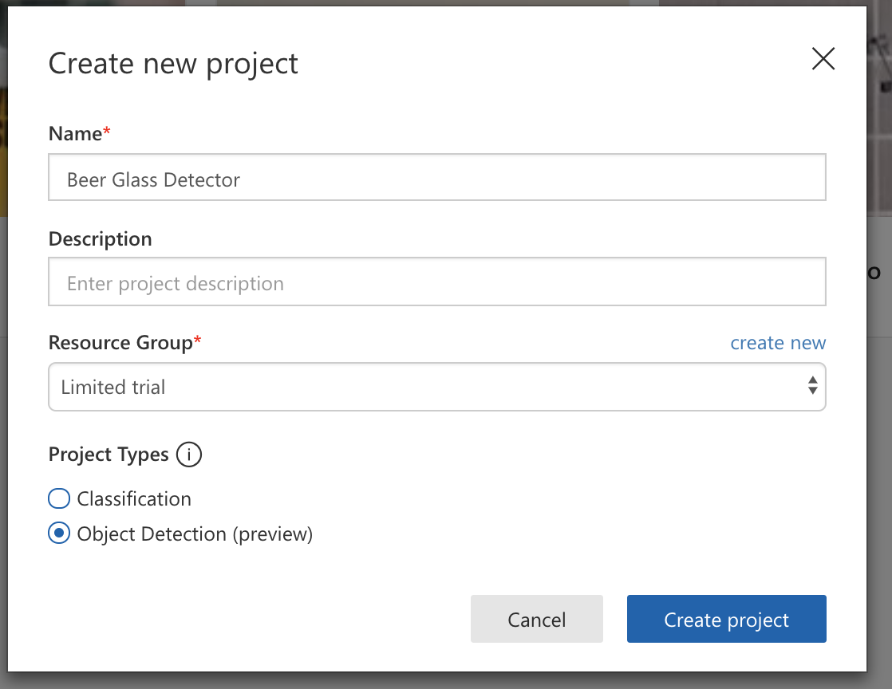
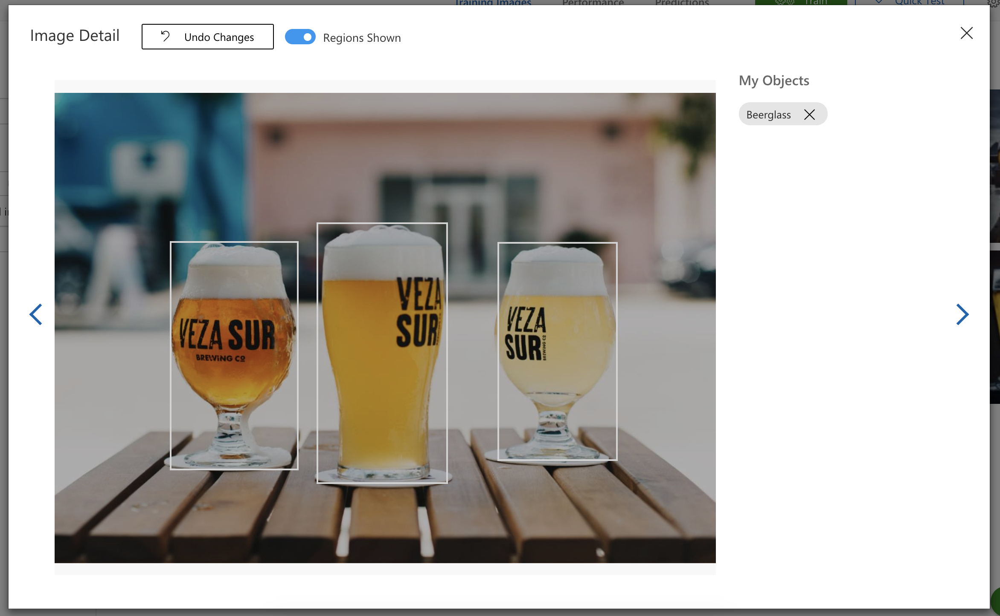
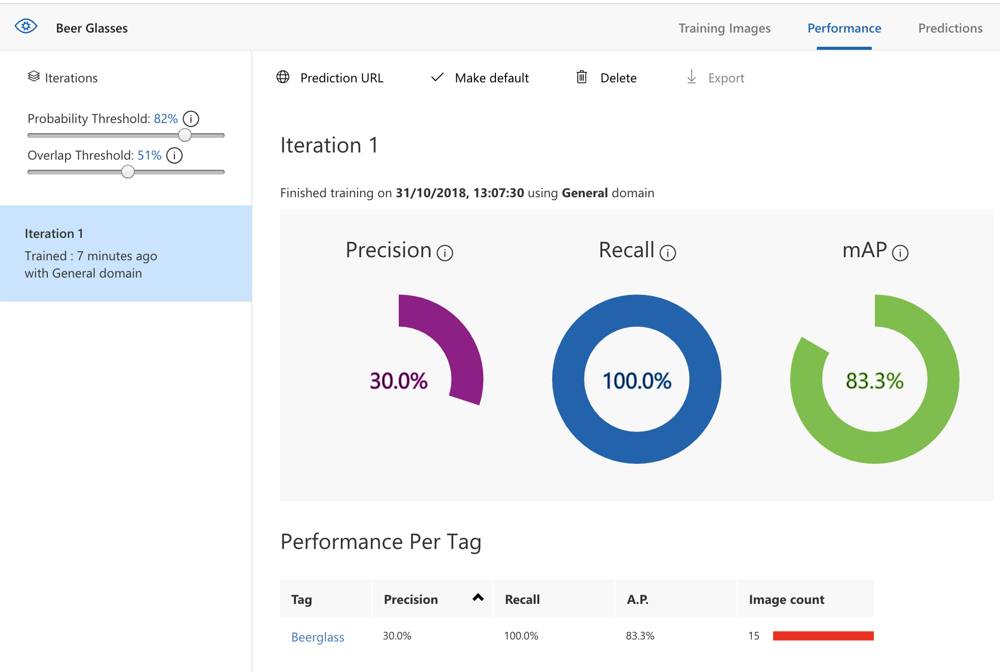

# Hints for Challenge 2

Create a new `Python 3.6 Notebook` in [Azure Notebooks](https://notebooks.azure.com/).

## Optical Character Recognition - Images to Text - Handwritten content

First, create a `Computer Vision` API Key in the Azure Portal:


As we're dealing with images, we need a few Python packages to help with this:

```python
import requests, json, time
import matplotlib.pyplot as plt
from matplotlib.patches import Rectangle
from matplotlib.patches import Polygon
from PIL import Image
from io import BytesIO
```

Ok, now we can start recognizing some text. With the Computer Vision API, this is a two-step process:

1. Submit the image
1. Query if the image has been processed

```python
key = "xxxx" # Paste your API Key here!

url = "https://westeurope.api.cognitive.microsoft.com/vision/v2.0/recognizeText"
image_url = "https://upload.wikimedia.org/wikipedia/commons/thumb/d/dd/Cursive_Writing_on_Notebook_paper.jpg/800px-Cursive_Writing_on_Notebook_paper.jpg"

headers = {'Ocp-Apim-Subscription-Key': key}
params  = {'mode': 'Handwritten'}
data    = {'url': image_url}

# Post image URL to the API
response = requests.post(url, headers=headers, params=params, json=data)

# Return query URL for getting the status
operation_url = response.headers["Operation-Location"]

# Poll until we get a result (...or something failed)
recogntion = {}
poll = True
while (poll):
    response_final = requests.get(operation_url, headers=headers)
    recogntion = response_final.json()
    time.sleep(1)
    if ("recognitionResult" in recogntion):
        poll= False 
    if ("status" in recogntion and recogntion['status'] == 'Failed'):
        poll= False

print(json.dumps(recogntion, indent=2))
```

Ok, looks like it recognized something. Let's visualize it:

```python
polygons = []

# Get bounding boxes of the text 
if ("recognitionResult" in recogntion):
    polygons = [(line["boundingBox"], line["text"])
        for line in recogntion["recognitionResult"]["lines"]]

# Display image and overlay text
plt.figure(figsize=(15, 15))
image = Image.open(BytesIO(requests.get(image_url).content))
ax = plt.imshow(image)
for polygon in polygons:
    vertices = [(polygon[0][i], polygon[0][i+1])
        for i in range(0, len(polygon[0]), 2)]
    text = polygon[1]
    patch = Polygon(vertices, closed=True, fill=False, linewidth=2, color='y')
    ax.axes.add_patch(patch)
    plt.text(vertices[0][0], vertices[0][1], text, fontsize=20, va="top")
_ = plt.axis("off")
```

Here are two more images we can test with:

```
https://bootcamps.blob.core.windows.net/ml-test-images/ocr_handwritten_1.jpg
https://bootcamps.blob.core.windows.net/ml-test-images/ocr_handwritten_2.jpg
```


## Optical Character Recognition - Images to Text - Printed content

Extracting text from printed text in images is very similar - except that is a synchronous call, hence we directly get back the recognition result:

```python
key = "xxxx" # Paste your API Key here!

url = "https://westeurope.api.cognitive.microsoft.com/vision/v2.0/ocr"
image_url = "https://bootcamps.blob.core.windows.net/ml-test-images/ocr_printed_1.jpg"

headers = {'Ocp-Apim-Subscription-Key': key}
params  = {'language': 'unk', 'detectOrientation': 'true'}
data    = {'url': image_url}

response = requests.post(url, headers=headers, params=params, json=data)
recognition_result = response.json()

# Extract the word bounding boxes and text
line_infos = [region["lines"] for region in recognition_result["regions"]]
word_infos = []
for line in line_infos:
    for word_metadata in line:
        for word_info in word_metadata["words"]:
            word_infos.append(word_info)
word_infos

# Display the image and overlay it with the extracted text
plt.figure(figsize=(15, 15))
image = Image.open(BytesIO(requests.get(image_url).content))
ax = plt.imshow(image, alpha=0.5)
for word in word_infos:
    bbox = [int(num) for num in word["boundingBox"].split(",")]
    text = word["text"]
    origin = (bbox[0], bbox[1])
    patch  = Rectangle(origin, bbox[2], bbox[3], fill=False, linewidth=2, color='y')
    ax.axes.add_patch(patch)
    plt.text(origin[0], origin[1], text, fontsize=12, weight="bold", va="top")
plt.axis("off")
```

Here are two more images we can test with:

```
https://bootcamps.blob.core.windows.net/ml-test-images/ocr_printed_1.jpg
https://bootcamps.blob.core.windows.net/ml-test-images/ocr_printed_2.jpg
```

## Detecting Objects in Images

First, log in to [Custom Vision](https://www.customvision.ai/) with your Azure credentials.

Create a new project of type `Object detection` and make sure to use the `Limited Trial` (object detection is currently only supported as a free trial, since it is not GA yet).



Next, add all the training images from the [dataset](). Once added, we need to tag all the beer glasses in the images. If there are multiple glasses in one image, tag each one individually:



Once we've tagged all 15 images (that's the minimum), we can hit the `Train` button. After 1-2 minutes, we'll see the training statistics:



Let's briefly look at the results and make sure we understand them:

Sliders - they set the results given certain thresholds
* Probability Threshold: 82% - this means we only count detections with over 82% probability as beer glasses
* Overlap Threshold: 51% - this means we want our detection results overlap at least 51% with the ground truth in the training set

Results:
* Precision: 30% - given a detection, it is 30% correct on average (meaning the algorithm will also detect other objects as glasses)
* Recall: 100% - a recall of 100% means, it will detect all beer glasses (but maybe mistake some other objects as beer glasses too)
* mAP: 83.3% - mean average precision - the average how well our detection algorithm works 

Under `Quick Test`, we can briefly upload our testing images and see what the service will detect. As we only added 15 training images with a lot of variance, the results are not great yet. By adding more images, we could most likely improve the detection performance significantly.

If we go to the `Performance` tab, we can get the `Prediction URL` and the `Prediction-Key`. We can use this endpoint to programmatically access the service.