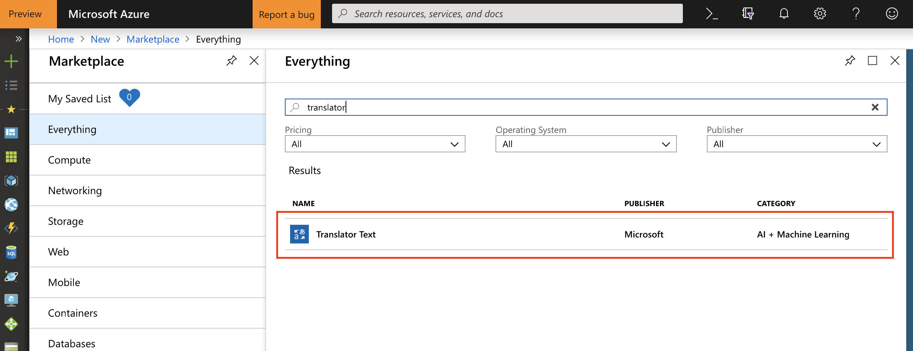
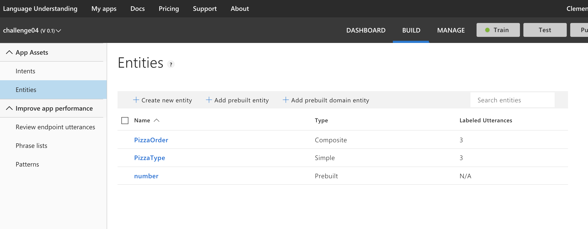
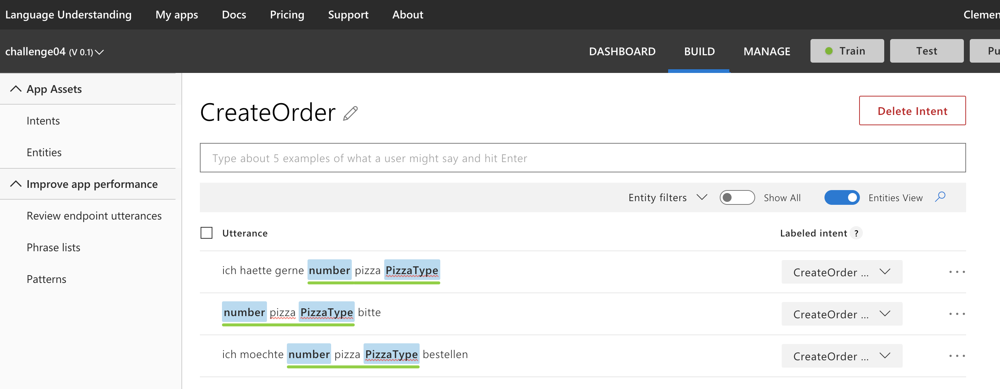

# Hints for Challenge 4

Create a new `Python 3.6 Notebook` in [Azure Notebooks](https://notebooks.azure.com/).

## Translate Text

First, create a `Translator Text` API Key in the Azure Portal:



As in challenge 3, we can create a token for our requests, but the Translator API also allows to direct access the service by specifying the API key:

```python
import requests, json

api_key = "xxx" # Paste your API key here

url = "https://api.cognitive.microsofttranslator.com/translate?api-version=3.0"
headers = {'Ocp-Apim-Subscription-Key': api_key, 'Content-type': 'application/json'}

params = {'to': 'de'}

body = [{'text' : 'I want to order 4 pizza Magarita and 8 beer!'},
        {'text' : 'Please add 42 salads to the order!'}]

response = requests.post(url, headers=headers, params=params, json=body)
print(json.dumps(response.json(), indent=2))
```

As we can see, we can translate multiple sentences within one API call. The service also automatically detects the input language. If desired, we can even directly translate the input to several output languages concurrently.

## Reveal the intention of the text

For retrieving the intent of the text, we'll be using the Language Understanding service in Azure, called LUIS. In many cases, LUIS is used to power chatbots, but it can also be used for "standalone" processing of text. We could even use it for e.g., automatically analyzing emails and categorizing them, or figuring out what products and amounts are on an invoice.

Head to [`eu.luis.ai`](https://eu.luis.ai) and create a new LUIS app. As a base language, fell free to either choose German or English (English supports a few more features as of October 2018).

Quick explanation on how LUIS works:

* Under Intents, we'll define the "actions" we can to detect
* Under Entities, we'll define the "things" we want to extract from the intents
* Utterances are just examples that we'll use to train LUIS

Create two new intents:

* `CreateOrder`
* `DeleteOrder`

Then, add the utterances (our training examples) from the main page of this repository to the three intents.

Hit `Train`.

Once we hit `Test`, we can test if the systems is able to recognize the intent of our text. We'll notice that it is not working that well, hence we can add some more examples and re-train.

Next, we can try to detect `Entities` in our text inputs. For that, goto Entities and add a `Prebuilt Entity` with the type `Number`. This will automatically detect all numbers (e.g. the order number or amount of pizzas) in our text. Secondly, add a normal Entity `Pizza Type` with entity type `Simple` (ideally we could also use an entity and specify all possible Pizzas we sell). Lastly, add an entity of type `Composite` with the name `PizzaOrder` and add `Number` and `Pizza Type` as children.



As we can see, LUIS supports a range of entity types, like regex, lists, etc.

Finally, we can annotate our training examples. Numbers will automatically be detected (as it is a prebuilt type), but we need to tell LUIS, what `PizzaOrder` is. This is a bit tricky, first click the beginning of the composite entity (= the detected number), tag it as `PizzaOrder`, then directly tag the last part of the entity (= the pizza type) also as `PizzaOrder`. Then tag all pizza types inside the `PizzaOrder` as `Pizza Type`. The final tagging should look something like this (make sure the green line covers the whole phrase):



Hit `Train` again to give it a final training. Lastly, hit `Publish` and publish it to `Production`. Review the endpoints and copy the endpoint URL (can be found under `Manage` --> `Keys and Endpoints`). It should look something like this:

```
https://westeurope.api.cognitive.microsoft.com/luis/v2.0/apps/xxxxxx-xxxx-xxxx-xxxx-xxxxxxxx?subscription-key=xxxxxxx&timezoneOffset=-360&q=
```

With a bit of Python, we can now get the intent through the API:

```python
import requests, json

# Paste your Endpoint URL here
url = "https://westeurope.api.cognitive.microsoft.com/luis/v2.0/apps/xxxxxx-xxxx-xxxx-xxxx-xxxxxxxx?subscription-key=xxxxxxx&timezoneOffset=-360&q="

query = "ich hätte gerne 9 pizza calzone"

response = requests.get(url + query)
print(json.dumps(response.json(), indent=2))
```

The output should look something like this:

```json
{
  "query": "ich h\u00e4tte gerne 9 pizza calzone",
  "topScoringIntent": {
    "intent": "CreateOrder",
    "score": 0.414687634
  },
  "entities": [
    {
      "entity": "calzone",
      "type": "PizzaType",
      "startIndex": 24,
      "endIndex": 30,
      "score": 0.6114218
    },
    {
      "entity": "9 pizza calzone",
      "type": "PizzaOrder",
      "startIndex": 16,
      "endIndex": 30,
      "score": 0.6957668
    },
    {
      "entity": "9",
      "type": "builtin.number",
      "startIndex": 16,
      "endIndex": 16,
      "resolution": {
        "value": "9"
      }
    }
  ],
  "compositeEntities": [
    {
      "parentType": "PizzaOrder",
      "value": "9 pizza calzone",
      "children": [
        {
          "type": "PizzaType",
          "value": "calzone"
        },
        {
          "type": "builtin.number",
          "value": "9"
        }
      ]
    }
  ]
}
```

Excellent - Now we know what the user wants to order, and the associated quantities. :pizza: :pizza: :pizza: