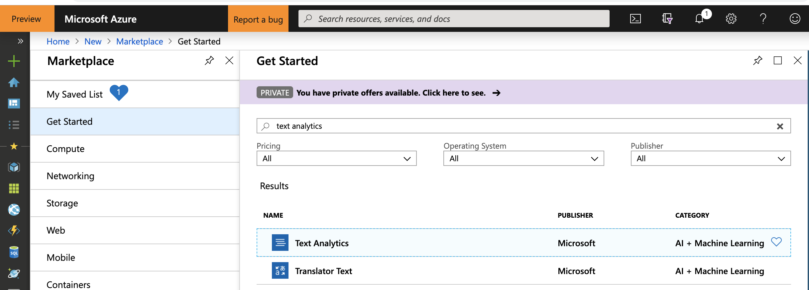

# Hints for Challenge 5

Create a new `Python 3.6 Notebook` in [Azure Notebooks](https://notebooks.azure.com/).

Then create a `Text Analytics` API Key in the Azure Portal (in the `West Europe` region):



Let's start with :

```python
import requests
from pprint import pprint

subscription_key = "xxx" # Paste your API key here
text_analytics_base_url = "https://westeurope.api.cognitive.microsoft.com/text/analytics/v2.1/"
headers = {"Ocp-Apim-Subscription-Key": subscription_key}
```

## Detect Language

Firstly, we can extract the language from text:

```python
language_api_url = text_analytics_base_url + "languages"

documents = { "documents": [
    { "id": "1", "text": "This is a document written in English." },
    { "id": "2", "text": "Este es un document escrito en Español." },
    { "id": "3", "text": "这是一个用中文写的文件" }
]}

response  = requests.post(language_api_url, headers=headers, json=documents)
languages = response.json()
pprint(languages)
```

## Detect Sentiment

Secondly, we can detect the sentiment of a given phrase:

```python
sentiment_url = text_analytics_base_url + "sentiment"

documents = {"documents" : [
  {"id": "1", "language": "en", "text": "I had a wonderful experience! The rooms were wonderful and the staff was helpful."},
  {"id": "2", "language": "en", "text": "I had a terrible time at the hotel. The staff was rude and the food was awful."},  
  {"id": "3", "language": "es", "text": "Los caminos que llevan hasta Monte Rainier son espectaculares y hermosos."},  
  {"id": "4", "language": "es", "text": "La carretera estaba atascada. Había mucho tráfico el día de ayer."}
]}

response  = requests.post(sentiment_url, headers=headers, json=documents)
sentiments = response.json()
pprint(sentiments)
```

## Detect Key Phrases

Thirdly, we can easily detect key phrases from text:

```python
keyphrase_url = text_analytics_base_url + "keyPhrases"

documents = {"documents" : [
  {"id": "1", "language": "en", "text": "I had a wonderful experience! The rooms were wonderful and the staff was helpful."},
  {"id": "2", "language": "en", "text": "I had a terrible time at the hotel. The staff was rude and the food was awful."},  
  {"id": "3", "language": "es", "text": "Los caminos que llevan hasta Monte Rainier son espectaculares y hermosos."},  
  {"id": "4", "language": "es", "text": "La carretera estaba atascada. Había mucho tráfico el día de ayer."}
]}

response  = requests.post(keyphrase_url, headers=headers, json=documents)
key_phrases = response.json()
pprint(key_phrases)
```

## Detect Entities

And last but not least, we can detect the entities in text:

```python
entities_url = text_analytics_base_url + "entities"

documents = {"documents" : [
  {"id": "1", "text": "Microsoft was founded by Bill Gates and Paul Allen on April 4, 1975, to develop and sell BASIC interpreters for the Altair 8800."}
]}

response  = requests.post(entities_url, headers=headers, json=documents)
entities = response.json()
pprint(entities)
```

If you want to directly create a dashboard within Power BI from the derived results, have a look at [this tutorial](https://docs.microsoft.com/en-us/azure/cognitive-services/text-analytics/tutorials/tutorial-power-bi-key-phrases).