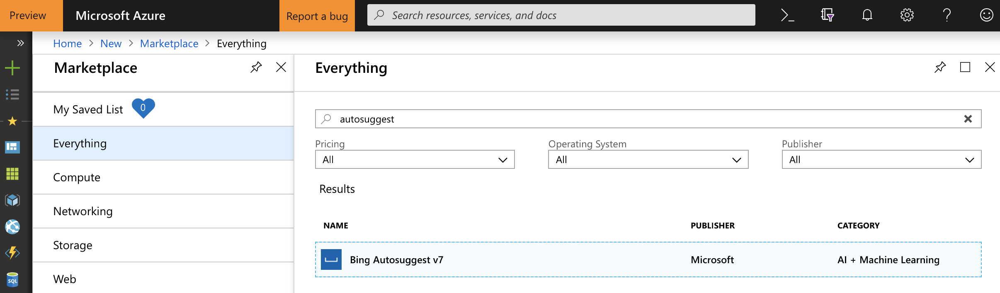

# Hints for Challenge 5

Create a new `Python 3.6 Notebook` in [Azure Notebooks](https://notebooks.azure.com/).

First, create a `Bing Autosuggeest` API Key in the Azure Portal:



As in challenge 3 and 5, we can either create a token for our requests, or directly access the service by specifying the API key we've just created:


```python
import requests, json

key = "xxx" # Paste your API key here
url = "https://api.cognitive.microsoft.com/bing/v7.0/suggestions"

search_term = "warum ist"

headers = {"Ocp-Apim-Subscription-Key" : key}
params  = {"q": search_term}

response = requests.get(url, headers=headers, params=params)
print(json.dumps(response.json(), indent=2))
```

Let's print it a bit nicer:

```python
suggestions = response.json()['suggestionGroups'][0]['searchSuggestions']

for s in suggestions:
    print(s['displayText'])
```

Output:

```json
warum ist gartenarbeit gut
warum ist meerwasser salzig
warum ist man
warum ist der himmel blau
warum ist die banane krumm
warum ist das licht gegeben
warum ist meine schwester haesslich
warum ist man genervt
```

People search for weird stuff... :flushed: :satisfied: